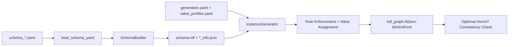

# PyGraft-SC
Master's thesis project: **Artificial Generation of Graph Data Using Real-World Configurations**


## What This Project Does
PyGraft-SC extends PyGraft to generate **domain-specific synthetic supply-chain knowledge graphs** instead of generic nodes (`C1`, `E1`, `R1`).

It takes three YAML inputs:
- ontology schema (`schema_*.yaml`)
- generation behavior (`generation.yaml`)
- literal value profiles (`value_profiles.yaml`)

Then it builds:
- a TBox ontology (`schema.rdf`)
- an ABox instance graph (`full_graph.<format>`)

with OWL-aware constraints, configurable distributions, and realistic supply-chain values.

## Core Contributions
- Domain-specific schema generation with three ontology variants (minimal, standard, extended).
- Rule-aware instance generation that respects class hierarchy, domain/range, inverse/functional properties, and disjointness constraints.
- Value Profile Engine for realistic literals (codes, dates, weighted choices, Faker-based names, relation-based temporal offsets).
- Reproducible generation through configurable random seeds and YAML-driven parameters.

## End-to-End Pipeline


## Schema Variants

| Variant | Classes | Object Properties | Datatype Properties | File |
|---|---:|---:|---:|---|
| Minimal | 4 | 5 | 3 | `pygraft/domains/supply_chain/ontology/schema_minimal.yaml` |
| Standard | 11 | 12 | 8 | `pygraft/domains/supply_chain/ontology/schema_standard.yaml` |
| Extended | 25 | 40 | 15 | `pygraft/domains/supply_chain/ontology/schema_extended.yaml` |

## Example Output Snapshot
These are example statistics from committed artifacts in `output/`.

| Schema | Entities | Instantiated Relations | Triples |
|---|---:|---:|---:|
| supply_chain_minimal | 3,664 | 5 | 4,455 |
| supply_chain | 2,271 | 11 | 2,424 |
| supply_chain_extended | 5,493 | 40 | 14,491 |

## Quickstart
Requirements:
- Python 3.8+
- Java (only if running consistency checks with HermiT)

PowerShell:

```powershell
python -m venv .venv
.\.venv\Scripts\activate
pip install -r requirements.txt
```

## Run
Default run:

```powershell
python -m cli.pygraft_sc --format ttl --out supply_chain_kg.ttl
```

Fast demo (skip reasoner):

```powershell
python -m cli.pygraft_sc --schema pygraft/domains/supply_chain/ontology/schema_minimal.yaml --skip-consistency --format ttl --seed 42 --out demo_minimal.ttl
```

Extended schema example:

```powershell
python -m cli.pygraft_sc --schema pygraft/domains/supply_chain/ontology/schema_extended.yaml --format ttl --seed 42 --out demo_extended.ttl
```

## CLI Options
- `--schema`: choose schema YAML (`schema_minimal.yaml`, `schema_standard.yaml`, `schema_extended.yaml`)
- `--format`: `ttl`, `json-ld`, `nt`, `rdf`, `xml`
- `--seed`: set deterministic random seed
- `--check-consistency / --skip-consistency`: toggle HermiT consistency checking
- `--out`: output file path

## Generated Artifacts
Each run writes:
- your selected `--out` file in the current directory
- generated artifacts under `output/<schema_name>/`, including:
  - `schema.rdf`
  - `class_info.json`
  - `relation_info.json`
  - `dataproperty_info.json`
  - `kg_info.json`
  - `full_graph.<ext>`

## Key Configuration Files
- `pygraft/domains/supply_chain/config/generation.yaml`
  - graph size (`num_entities`, `num_triples`)
  - typing controls (`multityping`, `avg_depth_specific_class`)
  - relation/class distribution controls (`relation_distribution`, `popularity_skew`)
  - reasoner settings (`kg_check_reasoner`, `reasoner_java_memory_mb`)
- `pygraft/domains/supply_chain/config/value_profiles.yaml`
  - domain literals (IDs, company names, crop types, shipment status, temporal offsets)

## Thesis Demo Guide
For a full oral-defense walkthrough and function-level call chain, see:

- `DEMO_GUIDE.md`
